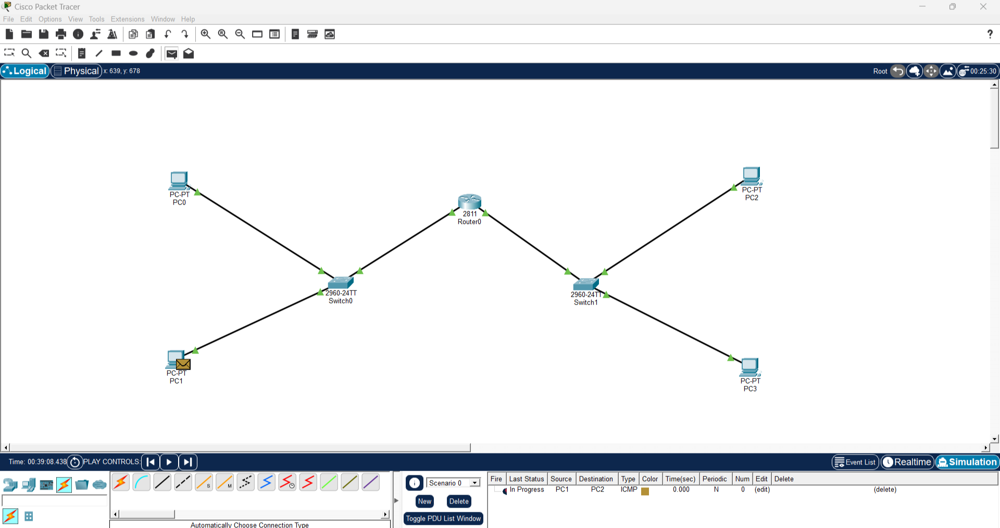
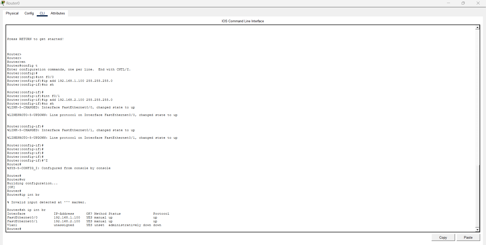

# Router-Based LAN Communication

## Overview
This project demonstrates communication between two Local Area Networks (LANs) connected through a Cisco router. The topology was created and tested using Cisco Packet Tracer.

## Objective
- Build two separate LANs.
- Connect both LANs using a router.
- Understand the role of switches and routers in network communication.
- Practice basic network topology design.

## Network Topology
- 1 Cisco 2811 Router
- 2 Cisco 2960 Switches
- 4 PCs

## Concepts Covered
- LAN Topology
- Router-Based Communication
- Switch Connectivity
- Basic Network Design

## Tools Used
- Cisco Packet Tracer

## Project Structure
```
PC0 ─┐
     │
PC1 ─┤
     │
 Switch0 ─ Router0 ─ Switch1
                      │
               ┌──────┴──────┐
              PC2          PC3
```

## Files Included
- `Router-Based-LAN-Communication.pkt`
### Network Topology

### Router CLI


## Author
Surendhar S N
B.Tech Information Technology
